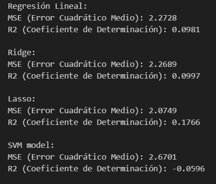

# Pokemon_Modelling

En este ultimo proyecto del temario abarcamos lo que seria el preprocesamiento de datos para poder hacer un **modelaje de ML** junto a tecnicas como el **Web Scrapping** o la extracción de datos via **API**. En este caso, para intentar aplicar un modelo lineal o de clasificacion como **KNN**.

## Datos

En esta primera fase del proyecto escogí mis datos, que en este caso son datos de Pokemon.

Primero encontré un data set en **Kaggle** con información sobre los pokemons de las primeras 7 generaciones.

Adicionalmente, saqué de la **API (PokeAPI)** información adicional sobre todas las evoluciones de todos los pokemons que tengo en el data set. Sobretodo para ver como funciona la extracción de cara al poryecto final.

También, he hecho el **Scrapping** de precios de la pagina web **Cardmarket**. Es una pagina web especializada en compra venta de cartas de todo tipo

## Objetivos

Con todo esto, lo que he pretendido en este proyecto es poder a parte de terminar de aprender toda la parte de **Scrapping** y **APIS**, la aplicación de modelos de **ML**:

**a)**  Modelo clasificación para poder predecir si se trata de un pokemon legendario o no.

**b)**  Modelo de regressión lineal o **SVM (Suppor Vector Machine)** para tratar de predecir el precio de una carta

## Procesamiento y extracción de Datos

**A)** Primera limpieza del data set, eliminando columnas no necesarias, capitalizando columnas, mirando duplicados y Nulos etc.. En resumén, una primera exploración, limpieza y estandarización de datos

**B)** Scrapping de datos de la web **Cardmarket** a través de una función. El resultado lo guardé en una lista vacia para poder exportarlo a **CSV**, ya que, el scrapping tardaba unos 180 mins. Ademas, una vez scrapeados los precios, limpie los datos para que aparecieran formateados correctamente

Una segunda parte de extracción de datos a través de la **API**, con lo que pude obtener todas evoluciones de los pokemons que tengo. Posteriormente tube que hacer limpieza y añadir algunos datos mas.

    

**C**) Una vez todos los datos fueron extraidos hice un merge con mi dataframe para traerme todos los datos a un unico dataframe.

En esta fase del proyecto me dediqué a hacer todo el resto de trabajo de limpieza y pre procesamiento de los datos para poder luego aplicar los modelos de **ML**.

Algunos ejemplos:

-   Trabajo con distintas columnas como Height y Wheight 

    

-   Corregir **types**

-   Sacar **subsets** para poder hacer **plots**

-   Sacar algunos datos sintenticos adicionales que nos serviran para la modelización:

    

# Visualizaciones

En esta fase del proyecto me dediqué a visualizar los datos que tenia en scope para ver como se distribuian o si se veian relaciones, outliers, etc...

-   Algunos ejemplos de los Plots:  

    

    

     -   Lo que podemos decir con esto es que el tipo mas común de pokemon es el de **agua**.
     Por contra, el tipo menos común sería el **volador**  

    

    -    Se observa que solo un 8% de los pokemons son legendarios

    

    -   Vemos que las generaciones con mas legendarios son la 4, 5 y 7.

    

    

    -   Segun estos graficos podemos intuir:

    -   Un pokemon con base type **psiquico** tiene bastantes probabilidades de ser legendario, así como, un pokemon con secondary type **volador**

    -   Ademas, si un pokemon tienen estas combinaciones de tipos tambien tiene probabilidades altas de ser legendario:
    **Dragon/Psiquico**, **Fuego/Volador** o **Electrico/Volador**

    

    -   Observamos la distribución de precios de cartas "Raras"

    

    -   Existe una correlación entre precio y estadisiticas clave de un pokemon? Observamos que por lo general no.

    

    -   Vemos que **Base_total** tiene buena correlacion con **Attack, defense, Hp..**, lo que tiene que sentido ya que la suma de estadisiticas nos dara la base total de ese pokemon.

    -  **Base_egg_steps** tiene buena correlacion con **legendary**, ya que, muchos de estos pokemons se obtienen de huevos que se abren caminando.

    -   **Height** tiene correlacion con **Weight**  

# Machine Learning

En esta ultima fase del proyecto intente aplicar los modelos de **ML** 
y quedarme con el fuera mas fiable para mis datos. 

Primeramente me saqué el subset para hacer la predicción de legendarios incluyendo solo los valores numericos de mi data set. A continuación, definí mi **X** e **Y**, y hice el split para el train test.
Cabe destacar que en este apartado usé un **0.4** de test size en vez de 0.2, porque el propio data set contiene pocos legendarios. De esta manera, incluye en el train test mas legendarios y mi modelo mejora.

A continuación, dado que estoy probando entre un **KNN** y un **Logisitic Regression** hago una estandarización con **StandardScaler()**.

Ahora que ya tengo los datos fiteados y transformados ya puedo probar los modelos.

**a) Logisitic Regression:** El score obtenido para este modelo es 0.975.   
Junto con el siguiente classification report y confussion matrix: 

**b) KNN:** Para poder aplicar este modelo debemos decidir el numero de vecinos que usaremos. Para esto sirve el siguiente codigo:

De manera que 5 y 10 vecinos serian los optimos y selecciono 10.    
Y obtengo el siguiente report y confussion matrix:

De manera, que prefiero quedarme con el modelo de **logisitic regression** que es marginalmente mejor.

Una vez listos estos modelos, paso a la predicción del precio.  
Aquí lo que intenté es sacar el mejor modelo de entre uno de **Regresión lineal**, **Lasso**, **Ridge** y **SVM**.

Esta vez comparando los **MSE** y **R2** obtenidos:

Realmente obtube unos resultados muy malos pero aun así probé de hacer **Hyper-Tunning** en el modelo **SVM** a ver si mejoraba mis estadisticas.

Y por ultimo, sin rendirme, me saqué un **VIF** para ver la **multicolinealidad** y probé de eliminar esas variables que mas la causaban pero aun así...

Algunos datos mejoran pero no lo suficiente, de manera, que ninguno de estos modelos me sirve para hacer una prediccion de precio segun mis datos. Lo que tiene bastante sentido, teniendo en cuenta que el principal factor que influye en el precio es la cantidad de cartas que sacan de cada tipo, (en este caso de "Raras") por cada pokemon y generación.

Ademas por lo que he podido ver en internet, estas cartas van en barajas que segun el "meta" hacen que sean mejores o peores y por tanto, mas o menos caras.

